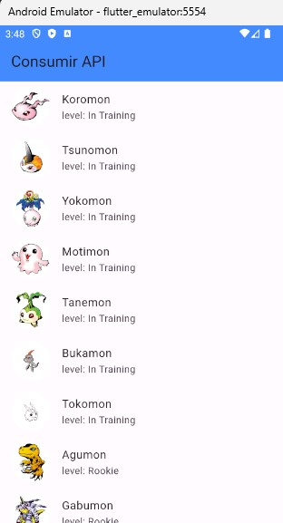

# flutter_getDigimonsFromApi

[fontes github](https://github.com/logicinfocursos/flutter_getDigimonsFromApi.git)

## getting started

Fico feliz com o seu interesse nesse código realizado com grande carinho. Trata-se de um template básico para que você possa usar como ponto de partida para os seus próximos projetos em flutter acessando uma api.

## resultado final

### referências de uso geral

- [lab: Escreva seu primeiro aplicativo Flutter](https://docs.flutter.dev/get-started/codelab)
- [cookbook: exemplos úteis do Flutter](https://docs.flutter.dev/cookbook)
- [documentação online + tutoriais](https://docs.flutter.dev/)
- [vscode](https://code.visualstudio.com/download)
- [postman](https://www.postman.com/downloads/)
- [insomnia](https://insomnia.rest/download)
- [conventional commits](https://www.conventionalcommits.org/en/v1.0.0/)

### plugins vscode de uso geral
- [dart](https://marketplace.visualstudio.com/items?itemName=Dart-Code.dart-code)
- [dart getters and setters](https://marketplace.visualstudio.com/items?itemName=Dart-Code.dart-code)
- [flutter](https://marketplace.visualstudio.com/items?itemName=Dart-Code.flutter)
-[flutter widget snippets](https://marketplace.visualstudio.com/items?itemName=alexisvt.flutter-snippets)
- [eslint](https://marketplace.visualstudio.com/items?itemName=dbaeumer.vscode-eslint)
- [thunder client](https://marketplace.visualstudio.com/items?itemName=rangav.vscode-thunder-client)

# sobre a logicinfo

somos uma consultoria em T.I. e atuamos com desenvolvimento de aplicações para todos os segumentos e mantemos também uma estrutura de treinamento com as melhores soluções para o aprendizado em programação.

alguns de nossos serviços:

- desenvolvimento de aplicações mobile, web e desktop
- a.i. generative - tenha uma i.a. focada em seu negócio, atendendo os seus clientes e fornecedores por whatsapp, chat e u.r.a.

visite o nosso site:
[logicinfo.com.br](https://logicinfo.com.br)

fale consoco:
whatsapp: [11 9 8627 4173](11-9-8627-4173)
e-mail: [contato@logicinfo.com.br](contato@logicinfo.com.br)
